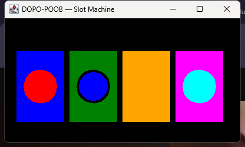
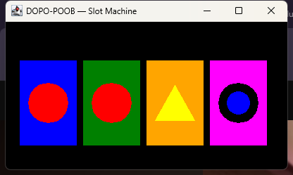

# slotMachine — DOPO-POOB · Ciclo 4 · 2026-2

> Cuarto ciclo del simulador de tragamonedas inspirado en el **Problem I – Slot Machine** de la ICPC World Finals 2025.  
> En este ciclo (**Refactoring y Extensión**) la máquina admite distintos tipos de ruedas y de símbolos.



---

## Autores

| Nombre | Correo |
|---|---|
| Kevin Garzón Romero | kevin.garzon-r@mail.escuelaing.edu.co |
| Daniel Blanco Salazar | daniel.blanco-s@mail.escuelaing.edu.co |

---

## Descripción del Ciclo 4

Los ciclos 1 y 2 construyeron el simulador gráfico y el ciclo 3 agregó la resolución automática (`solve`) y su simulación (`simulate`).  
En este ciclo se agrega el requisito de **extensibilidad**:

1. **Tipos de rueda:** `normal` (la de siempre), `lefty` (copia a la rueda de su izquierda al girar), `rebel` (no se deja bloquear, intercambiar ni eliminar) y `turbo` (propuesta del equipo: avanza el doble).
2. **Tipos de símbolo:** `normal` (el de siempre), `ephemeral` (se encoge en cada giro hasta ser un punto) y `shy` (alterna entre visible e invisible cada vez que se selecciona).

Los tipos se crean por nombre (`addWheel("lefty", 2)`, `addSymbol("shy", 3, "yellow")`) y se distinguen a simple vista: cada tipo de rueda tiene un color de marco propio y cada tipo de símbolo una figura propia. Agregar un tipo nuevo no obliga a modificar `SlotMachine`.

---

## Requisitos funcionales del Ciclo 4

| # | Caso de uso | Método / clase | Estado |
|---|---|---|---|
| 16 | Manejar diferentes tipos de ruedas y de símbolos | `addWheel(type, pos)`, `addSymbol(type, pos, color)`, `WheelFactory`, `SymbolFactory` | [x] |
| 17 | Ruedas `normal`, `lefty` y `rebel` | `NormalWheel`, `LeftyWheel`, `RebelWheel` | [x] |
| 18 | Símbolos `normal`, `ephemeral` y `shy` | `NormalSymbol`, `EphemeralSymbol`, `ShySymbol` | [x] |
| 19 | Un tipo nuevo propuesto por el equipo | `TurboWheel` (avanza el doble) | [x] |
| — | Usabilidad: los tipos se distinguen visualmente | Color de marco por tipo de rueda; figura por tipo de símbolo | [x] |

> **Verificación:** 13 pruebas propias y 3 compartidas en JUnit 4 pasan, y las 28 pruebas de los ciclos 2 y 3 siguen en verde. Para validar las pruebas se introdujeron 15 errores a propósito en el código y las pruebas detectaron los 15.

### Los tipos de un vistazo

| Elemento | Tipo | Regla | Se ve como |
|---|---|---|---|
| Rueda | `normal` | La del ciclo 3 | Marco azul |
| Rueda | `lefty` | Al girar copia el símbolo de la rueda de su izquierda | Marco verde |
| Rueda | `rebel` | No se bloquea, ni se intercambia, ni se elimina | Marco naranja |
| Rueda | `turbo` | Cada giro avanza el doble | Marco magenta |
| Símbolo | `normal` | El del ciclo 3 | Círculo |
| Símbolo | `ephemeral` | Se encoge 8 px en cada giro hasta ser un punto de 4 px | Disco con aro negro |
| Símbolo | `shy` | Alterna visible/invisible cada vez que se selecciona | Triángulo |



---

## Cambios respecto al Ciclo 3

### `Symbol.java` — Ahora es abstracta

Es la base de la jerarquía de símbolos: guarda el color y la posición, y define `getType()`, `moveTo`, `makeVisible` y `makeInvisible`. Agrega dos ganchos que cada tipo redefine: `onSpin()` (un giro lo deja seleccionado) y `onPlaced()` (lo deja seleccionado `placeSymbol`).

- **`NormalSymbol`** — nuevo: el círculo del ciclo 3.
- **`EphemeralSymbol`** — nuevo: disco dentro de un aro negro que se encoge en cada giro.
- **`ShySymbol`** — nuevo: triángulo que alterna escondido/mostrado. Su color sigue contando para el jackpot.
- **`SymbolFactory`** — nuevo: `create(type, color)`, `isValidType(type)` y `types()`.

### `Wheel.java` — Ahora es abstracta

Es la base de la jerarquía de ruedas. Define los ganchos `getType()`, `canLock()`, `canSwap()`, `canDelete()`, `frameColor()`, `effectiveSteps(steps)` y `followLeft()`. `lock()` ahora devuelve `boolean`. Nuevos: `getCurrentSymbol()` y `addSymbol(pos, type, color)`.

- **`NormalWheel`** — nuevo: la rueda del ciclo 3.
- **`LeftyWheel`** — nuevo: al girar se coloca en el símbolo que muestra su vecina de la izquierda.
- **`RebelWheel`** — nuevo: `canLock`, `canSwap` y `canDelete` devuelven `false`.
- **`TurboWheel`** — nuevo: `effectiveSteps` multiplica por 2.
- **`WheelFactory`** — nuevo: `create(type, x, y)`, `isValidType(type)` y `types()`.

### `SlotMachine.java` — Modificado

- `addWheel(String type, int pos)` y `addSymbol(String type, int pos, String color)`: crean por tipo; con un tipo desconocido fallan (`ok() = false`). Las firmas antiguas siguen creando elementos `normal`.
- `lock(int wheel)` ahora devuelve **cuántas ruedas quedan bloqueadas** (`int`), también cuando falla.
- `swap`, `delWheel` y `lock` respetan a las ruedas `rebel`.
- `wheelTypes()` y `symbolTypes()`: consultan el tipo de cada rueda y de cada símbolo.
- Guarda el tipo de cada símbolo junto a su color, para que una rueda creada después herede los símbolos con su tipo.

### Sin cambios

`SlotMachineContest` (`solve`, `simulate`), `SlotMachineView`, `Canvas`, `Circle`, `Rectangle`, `Triangle` (que ahora sí se usa) y las pruebas de los ciclos 2 y 3. `SlotMachine(n)`, `solve` y `simulate` solo usan tipos `normal`, así que se comportan igual que en el ciclo 3.

### Reglas e interpretaciones

| Tipo | Regla aplicada |
|---|---|
| `lefty` | Copia el **símbolo visible** de la rueda de su izquierda. Con `spin(w, k)` copia una sola vez; con `spin()` se gira de izquierda a derecha. La primera rueda gira normal. Bloqueada, no copia |
| `ephemeral` | Se encoge cuando un **giro** lo deja seleccionado; `placeSymbol` no lo encoge. No se recupera |
| `shy` | Alterna cuando lo selecciona un giro **o** `placeSymbol`. Escondido, su color sigue contando en `configuration()`, `distinctSymbols()` e `isJackpot()` |
| `rebel` | `lock`, `swap` y `delWheel` fallan con `ok() = false` y no cambian nada |
| `turbo` | `spin(w)` avanza 2 y `spin(w, k)` avanza `2k` |

### Limitaciones

- `solve` y `simulate` solo funcionan con ruedas y símbolos `normal`.
- Un símbolo del mismo color que el marco de su rueda no se ve (azul sobre azul, verde sobre verde…).
- Los diagramas del ciclo 4 están casi completos en Astah: el diagrama de clases y los 9 diagramas de secuencia de lo que cambió ya se generaron (`slotMachinec4.asta`, creado con `astah_clases_c4.js` y `astah_secuencias_c4.js`); faltan los casos de uso y los estados.
- No se ha ejecutado aún dentro de BlueJ; las pruebas se corrieron con `javac` y las librerías JUnit de BlueJ.

---

## Estructura del proyecto (Ciclo 4)

```
Ciclo3/
├── Documents/
│   ├── Cic4/
│   │   ├── README_Ciclo4.md           ← Este archivo
│   │   ├── RetrospectivaFinal.md      ← Retrospectiva de todos los ciclos
│   │   └── demo_tipos_1.png, demo_tipos_2.png  ← Capturas de la máquina
│   └── BlancoS-GarzonR.txt            ← URL del repositorio para Moodle
└── slotMachine/
    ├── Symbol.java                    ← Modificado: abstracta
    ├── NormalSymbol.java              ← NUEVO
    ├── EphemeralSymbol.java           ← NUEVO
    ├── ShySymbol.java                 ← NUEVO
    ├── SymbolFactory.java             ← NUEVO
    ├── Wheel.java                     ← Modificado: abstracta, ganchos por tipo
    ├── NormalWheel.java               ← NUEVO
    ├── LeftyWheel.java                ← NUEVO
    ├── RebelWheel.java                ← NUEVO
    ├── TurboWheel.java                ← NUEVO (tipo propio)
    ├── WheelFactory.java              ← NUEVO
    ├── SlotMachine.java               ← Modificado: tipos, lock devuelve int
    ├── SlotMachineC4Test.java         ← NUEVO: 13 pruebas propias del Ciclo 4 (JUnit 4)
    ├── SlotMachineCC4Test.java        ← NUEVO: 3 pruebas compartidas del Ciclo 4 (JUnit 4)
    ├── SlotMachineAcceptanceTest.java ← NUEVO: las 2 pruebas de aceptación automatizadas (JUnit 4)
    ├── SlotMachineContest.java        ← Sin cambios
    ├── SlotMachineView.java, Canvas.java, Circle.java, Rectangle.java, Triangle.java  ← Sin cambios
    └── SlotMachineContestTest, SlotMachineContestCTest, SlotMachineC2Test, SlotMachineCC2Test  ← Sin cambios
```

---

## Cómo ejecutar

### Requisitos previos

- **Java SE 8** o superior.
- **BlueJ 5.x**.

### Probar los tipos

1. Abrir el proyecto en BlueJ y pulsar **Compile**.
2. Clic derecho sobre `SlotMachine` → `new SlotMachine()` → nombre `sm`; ejecutar `sm.makeVisible()`.
3. Crear ruedas por tipo: `sm.addWheel("normal", 1)`, `sm.addWheel("lefty", 2)`, `sm.addWheel("rebel", 3)`, `sm.addWheel("turbo", 4)` (con comillas).
4. Agregar símbolos: `sm.addSymbol(1, "red")`, `sm.addSymbol("shy", 2, "yellow")`, `sm.addSymbol("ephemeral", 3, "cyan")`.
5. Girar y probar: `sm.spin(2)` (la `lefty` copia), `sm.lock(3)` (la `rebel` lo rechaza con un diálogo y devuelve 0), `sm.spin(4)` (la `turbo` avanza dos).

### Pruebas de aceptación

Preparamos dos pruebas de aceptación, una por cada grupo de requisitos (17 y 18), y las tenemos de dos formas: **manual**, para mostrarlas en la presentación, y **automatizada**, con una clase de pruebas en Java. Las dos hacen los mismos pasos.

#### Manual (para la presentación)

Se hacen en BlueJ con la máquina visible. Cada operación rechazada abre un diálogo de error, que se cierra con *Aceptar*.

**Aceptación 1 — tipos de rueda.** `addWheel` de `normal`, `lefty`, `rebel` y `turbo`; símbolos `red`, `yellow`, `cyan`, `pink`.
1. Se ven cuatro marcos distintos (azul, verde, naranja, magenta) y el banner dorado de jackpot.
2. `placeSymbol(1,"cyan")`, `placeSymbol(2,"red")`, `placeSymbol(3,"yellow")`; luego `spin(2)`: la `lefty` queda en cian (copió a la 1).
3. `spin()`: la `lefty` copia a la 1 y la `turbo` avanza dos símbolos.
4. `lock(3)`, `swap(1,3)` y `delWheel(3)` sobre la `rebel`: los tres fallan (`ok()` falso), `lock(3)` devuelve 0 y nada cambia.
5. `lock(1)` devuelve 1 y el marco pasa a rojo.

**Aceptación 2 — tipos de símbolo.** Dos ruedas normales; símbolos `ephemeral` rojo, `shy` amarillo y normal cian.
1. Ambas muestran un disco rojo con aro negro.
2. `placeSymbol(1,"yellow")` esconde el triángulo (la rueda queda vacía y `configuration()` sigue diciendo `yellow`); repetirlo lo muestra.
3. `spin(2, 3)` tres veces: el disco rojo de la rueda 2 baja a 40, 32 y 24 px; `spin(2, 18)` lo deja como un punto de 4 px.
4. Con ambas ruedas en `yellow` hay jackpot aunque haya un triángulo escondido.

#### Automatizada (`SlotMachineAcceptanceTest`)

Las dos pruebas manuales se pasaron a código en la clase `SlotMachineAcceptanceTest` (JUnit 4): `shouldAcceptWheelTypes` es la aceptación 1 y `shouldAcceptSymbolTypes` es la aceptación 2. Repiten los mismos pasos, pero sin ventana: en lugar de mirar la pantalla, comprueban lo que devuelve la máquina (`configuration()`, `ok()`, `lock`, `isJackpot()`) y el tamaño o la visibilidad de los símbolos. Así se pueden correr en cualquier momento, con clic derecho en la clase → **Test All**.

Lo que solo se ve en pantalla (los colores de los marcos, el banner dorado y las figuras) se sigue comprobando con la versión manual.

### Ejecutar pruebas unitarias

1. Activar **Tools → Preferences → Miscellaneous → Show unit testing tools** (una sola vez).
2. Clic derecho en `SlotMachineC4Test` → **Test All** (13 pruebas) y en `SlotMachineCC4Test` (3 pruebas); verde = pasó.
3. La prueba que abre la ventana se omite si no hay pantalla. Con pantalla, las dos clases juntas tardan unos 7 s.
4. Ejecutar también `SlotMachineContestTest` (10 pruebas) para comprobar que `solve` y `simulate` no se afectaron.

---

## Mini-ciclos del Ciclo 4 (26 septiembre – 3 octubre)

| # | Descripción | Criterio de completitud | Estado |
|---|---|---|---|
| 1 | **Análisis, diseño y refactor (26 sep).** Lectura del enunciado, decisiones de diseño; `Symbol` y `Wheel` pasan a jerarquías (`NormalSymbol`, `NormalWheel`) y la secuencia de símbolos guarda el tipo. | Compila y las pruebas anteriores siguen en verde. | [x] |
| 2 | **Fábricas y creación por tipo (27 sep).** `WheelFactory`, `SymbolFactory`, `addWheel(type, pos)` y `addSymbol(type, pos, color)`; tipos inválidos. | Se crea una máquina con tipos mezclados; las firmas antiguas siguen creando `normal`. | [x] |
| 3 | **Ruedas `lefty` y `rebel` (28 sep).** Copia del estado de la vecina izquierda; rechazo de lock/swap/delete; `lock` devuelve `int`. | Pruebas de ambas ruedas verdes, incluida la vecina cambiante y el estado intacto tras un rechazo. | [x] |
| 4 | **Símbolos `ephemeral` y `shy` (29 sep).** Encogimiento hasta el punto; alternancia de visibilidad; regla de jackpot con símbolos escondidos. | Tamaños 48→4 y alternancia comprobados; `isJackpot()` no cambia. | [x] |
| 5 | **Tipo propio y revisión visual (30 sep).** `TurboWheel` (avanza el doble); distinción visual de los tipos; captura con pantalla real. | Los tipos se ven distintos; `solve` y `simulate` siguen igual. | [x] |
| 6 | **Pruebas y aceptación (1 – 2 oct).** `SlotMachineC4Test` (13), `SlotMachineCC4Test` (3), 2 pruebas de aceptación (manuales y automatizadas en `SlotMachineAcceptanceTest`), validación con 15 errores introducidos, documentación. | Todas las pruebas verdes; guion de aceptación ejecutado paso a paso. | [x] 13 + 3 pruebas JUnit 4 |
| 7 | **Retrospectiva y entrega (3 oct).** Diagramas en Astah, publicación en Git y entrega en Moodle. | Diagramas exportados, repositorio actualizado y `.txt` publicado. | [x] |

---

## Retrospectiva

### Ciclo 4

**1. ¿Cuáles fueron los mini-ciclos definidos? Justifíquenlos.**

Se definieron 7 mini-ciclos ordenados de la base a lo visible: primero el refactor sin cambiar comportamiento (para que las 28 pruebas existentes sirvieran de red de seguridad), después las fábricas (el punto de extensión), luego las dos jerarquías por separado —ruedas y símbolos— porque sus reglas no se tocan entre sí, el tipo propio, las pruebas y la aceptación, y al final la entrega. Separar ruedas de símbolos permitió comprobar cada regla de forma aislada antes de combinarlas, y dejar el refactor primero evitó mezclar «cambio de estructura» con «cambio de comportamiento».

**2. ¿Cuál es el estado actual del proyecto en términos de mini-ciclos? ¿Por qué?**

Los mini-ciclos 1 a 6 están completos: los requisitos 16, 17, 18 y 19 están implementados (`lefty`, `rebel`, `ephemeral`, `shy` y el tipo propio `turbo`), con 13 pruebas propias y 3 compartidas en verde, y las 28 pruebas de los ciclos anteriores siguen pasando. El mini-ciclo 7 queda a medias: la retrospectiva y la documentación están escritas, pero **faltan los diagramas de Astah** (el diagrama de clases y los 9 diagramas de secuencia de lo que cambió ya se generaron con scripts de Astah; faltan los casos de uso y los estados), **publicar en Git** y subir el `.txt` a Moodle. También falta ejecutar y validar el proyecto dentro de BlueJ, ya que las pruebas se corrieron con `javac` y las librerías JUnit de BlueJ.

**3. ¿Cuál fue el tiempo total invertido por cada uno de ustedes? (Horas/Hombre)**

| Integrante | Horas |
|---|---|
| Kevin Garzón Romero | ~15 h |
| Daniel Blanco Salazar | ~15 h |
| **Total** | **~30 h** |

**4. ¿Cuál consideran fue el mayor logro? ¿Por qué?**

Que agregar un tipo nuevo no obligue a tocar `SlotMachine`: `TurboWheel` se añadió con una subclase, una constante y una línea en la fábrica, que es lo que pide el requisito implícito de extensibilidad. Además se mantuvo todo lo anterior intacto: `solve`, `simulate` y las 10 pruebas de `SlotMachineContestTest` no cambiaron y siguen verdes. Y las pruebas se validaron de verdad: de 15 errores introducidos a propósito en el código, las pruebas detectaron los 15.

**5. ¿Cuál consideran que fue el mayor problema técnico? ¿Qué hicieron para resolverlo?**

La secuencia de símbolos era una lista de colores compartida por todas las ruedas; no guardaba el tipo, así que un símbolo `shy` o `ephemeral` no podía crearse en una rueda nueva. Se resolvió guardando el tipo junto al color (`symbolTypes`) y haciendo que cada rueda construya sus propios símbolos con la fábrica; de ahí que una rueda creada después herede los símbolos con su tipo (hay una prueba para eso).

El otro problema fue **dibujar** los tipos de modo distinguible: un `ephemeral` que empieza en 48 px se parece a uno normal, y `Triangle` dibuja desde el vértice y no desde la esquina. Se resolvió con un aro negro fijo alrededor del disco que se encoge, y ajustando la posición del triángulo; se comprobó con una captura de pantalla real. Queda una limitación: un símbolo del mismo color que el marco de su rueda no se ve.

**6. ¿Qué hicieron bien como equipo? ¿Qué se comprometen a hacer para mejorar los resultados?**

Aplicamos lo que prometimos en el ciclo 3: las pruebas comprueban el resultado real (jackpot, tamaños, color mostrado, estado intacto tras un rechazo) y no solo la forma de la salida, y se validaron con errores introducidos a propósito. Planificar los mini-ciclos con fechas nos dio un orden claro. Lo que quedó mal: dejamos los diagramas de Astah para el final, otra vez, y es lo que sigue pendiente. Nos comprometemos a actualizar el diagrama al terminar cada mini-ciclo en los proyectos siguientes, a probar dentro de BlueJ antes de cerrar un ciclo y a consultar con el profesor las interpretaciones dudosas (por ejemplo qué significa «copia su estado» en `lefty`) antes de implementarlas, no después.

**7. Considerando las prácticas XP incluidas en los laboratorios, ¿cuál fue la más útil? ¿Por qué?**

El **refactoring con pruebas de regresión**. Pasar `Symbol` y `Wheel` a clases abstractas tocaba casi todo el proyecto; poder correr las 28 pruebas después de cada paso nos permitió hacer el cambio sin miedo. La segunda más útil fue la **integración continua en pequeño**: compilar y correr todas las pruebas al terminar cada mini-ciclo.

**8. ¿Qué referencias usaron? ¿Cuál fue la más útil? Incluyan citas con estándares adecuados.**

| # | Referencia | Uso |
|---|---|---|
| 1 | Escuela Colombiana de Ingeniería. (2026). *Proyecto inicial 2026-2 — Ciclo No. 4/4: Refactoring y Extensión* [Enunciado en PDF]. | Requisitos 16–19 y diagrama de clases de referencia. |
| 2 | Gamma, E., Helm, R., Johnson, R. & Vlissides, J. (1994). *Design Patterns: Elements of Reusable Object-Oriented Software*. Addison-Wesley. | Idea de fábrica (*Factory Method*) y de jerarquías por tipo. |
| 3 | Fowler, M. (2018). *Refactoring: Improving the Design of Existing Code* (2.ª ed.). Addison-Wesley. | Refactor de `Symbol` y `Wheel` sin cambiar el comportamiento. |
| 4 | Oracle. (s.f.). *Java SE 8 API: java.util.ArrayList, java.util.HashSet*. https://docs.oracle.com/javase/8/docs/api/ | Estructuras usadas en `SlotMachine` y en las pruebas. |
| 5 | JUnit Team. (s.f.). *JUnit 4 — Assume, @Test(timeout)*. https://junit.org/junit4/ | Pruebas, omitir la que necesita pantalla, tiempo máximo. |
| 6 | Kolling, M. & Barnes, D. J. (2016). *Objects First with Java* (6.ª ed.). Pearson. | Diseño OO y BlueJ. |
| 7 | Anthropic. (2026). *Claude Code (Sonnet 5.5)* [IA]. https://claude.com/claude-code | Asistente utilizado probar y documentar este ciclo; todo se revisó contra el código y las pruebas. |

La más útil fue el **enunciado del ciclo y su diagrama de clases**, porque fijó los nombres y firmas (`addWheel(type, pos)`, `addSymbol(type, pos, color)`, `lock`) que se respetaron.

> Esta retrospectiva también está en `RetrospectivaFinal.md`, junto con la de los ciclos anteriores.
